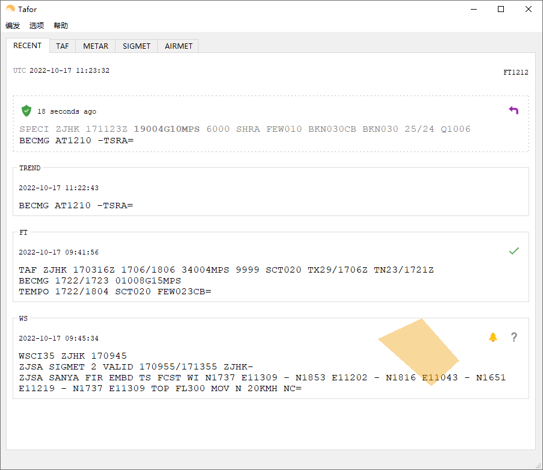

# Tafor

本软件用于民航气象部门智能发布预报报文、趋势报文、重要气象情报，监控预报报文，以声音或电话的方式返回告警。

## 功能
- TAF 报文编辑
- TREND 报文编辑
- SIGMET 报文编辑
- 监控与告警
    - 自动 METAR、TAF 报文入库查询
    - TAF 报文迟发告警
    - 报文发布提醒

## 文档
文档托管于 Read The Docs，用户指南，安装部署说明都可以在这里找到。

[Tafor 文档](http://tafor.readthedocs.io)

## 预览

## 参考
- [TAF Decode]
- [SIGMET Introduction]

## 感谢
软件 TAF 报文编辑界面参考了湛江空管站张永华先生所写的湛江预报发报软件，感谢张永华先生的支持与理解。

## 贡献代码
欢迎提交 Issue 或者 Pull Request。

## 开源协议
[GPLv2](LICENSE)

  [TAF Decode]: https://www.aviationweather.gov/static/help/taf-decode.php
  [SIGMET Introduction]: https://en.wikipedia.org/wiki/SIGMET